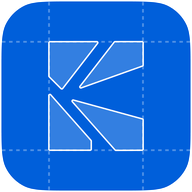
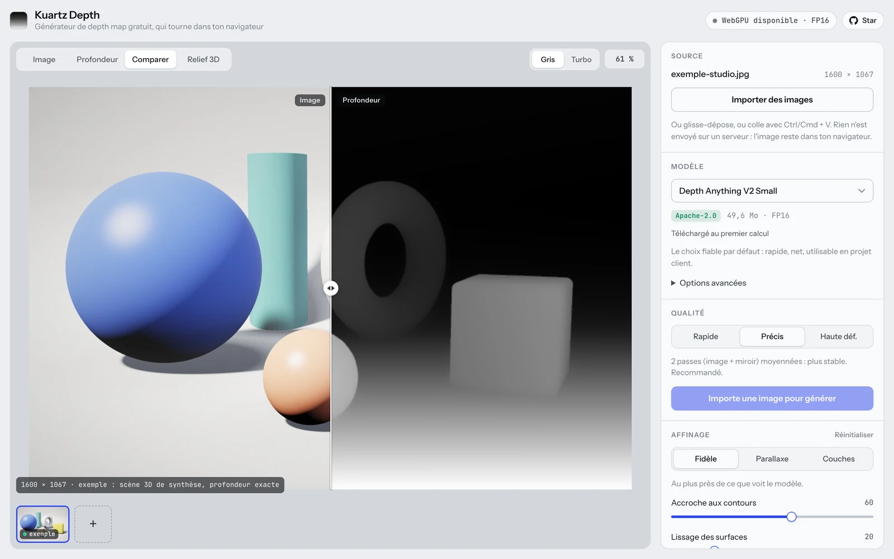
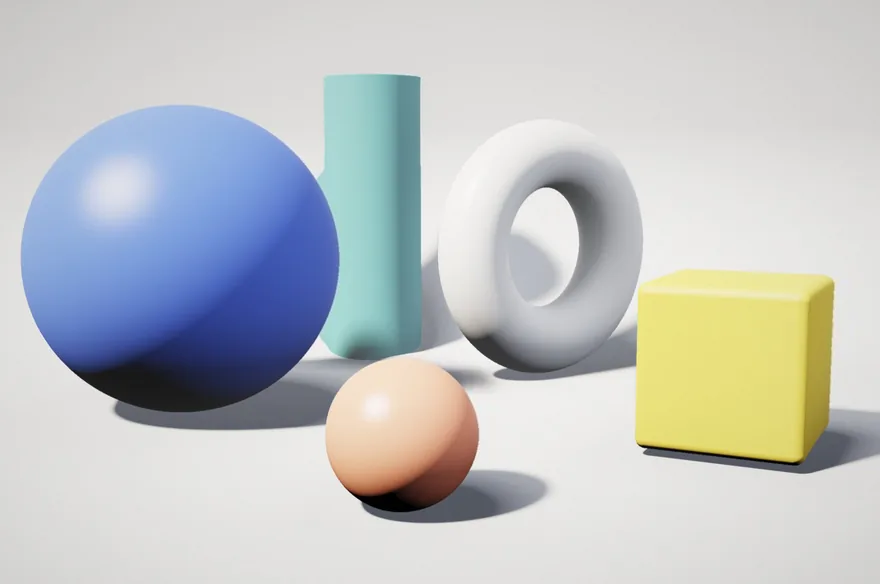
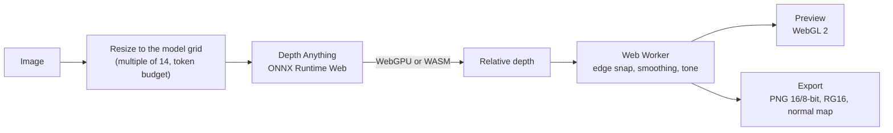

<div align="center">



# Kuartz Depth

**Free, open-source depth map generator that runs entirely in your browser.**

Drop any image and get a clean depth map in seconds with Depth Anything V2 and 3,<br>
on your GPU (WebGPU) or your CPU (WebAssembly). Your images never leave your machine.

[**Try it live**](https://tool-depthmap-generator.vercel.app) · [Report a bug](https://github.com/Kuartz-studio/tool-depthmap-generator/issues/new?template=bug_report.yml) · [Request a feature](https://github.com/Kuartz-studio/tool-depthmap-generator/issues/new?template=feature_request.yml)

[](LICENSE)
[](https://github.com/Kuartz-studio/tool-depthmap-generator/actions/workflows/ci.yml)
[](https://nextjs.org)
[](https://onnxruntime.ai/docs/tutorials/web/)
[](https://github.com/Kuartz-studio/tool-depthmap-generator/stargazers)

<picture>
  <source media="(prefers-color-scheme: dark)" srcset=".github/assets/app-dark.webp">
  
</picture>

</div>

## Features

- **100% local.** Inference runs in your browser. Only the model weights are downloaded, once, then cached.
- **Modern models.** Depth Anything V2 Small, Depth Anything 3 Small and Base, or bring your own `.onnx`.
- **GPU or CPU.** WebGPU (FP16 when the GPU supports it), or multithreaded WebAssembly as a fallback.
- **Three quality modes.** Fast (one pass), Precise (image and mirror averaged), HD (global pass plus 2× tiles, fused for large images).
- **Edge-aware refinement.** Snap depth to image edges, flatten texture noise while keeping contours, widen and soften the foreground for parallax, set far and near planes, curve, posterized layers, invert.
- **Relief 3D preview.** An occlusion-aware parallax shader, driven by the mouse or an automatic orbit.
- **Exports.** 16-bit PNG, 8-bit PNG, WebGL RG (16 bits packed in two 8-bit channels), normal map, batch `.zip`, or copy to the clipboard to paste into Figma.
- **Drop-in WebGL snippet.** The same parallax shader, ready to use with [OGL](https://github.com/oframe/ogl).

<p align="center">
  
</p>

> [!NOTE]
> The interface is in French for now. An English version is one of the most welcome contributions.

## Quick start

Use the hosted version at **[tool-depthmap-generator.vercel.app](https://tool-depthmap-generator.vercel.app)**, or run it locally with Node.js 20.9+:

```bash
git clone https://github.com/Kuartz-studio/tool-depthmap-generator.git
cd tool-depthmap-generator
npm install
npm run dev
```

Then open http://localhost:3000.

### Deploy your own

[](https://vercel.com/new/clone?repository-url=https%3A%2F%2Fgithub.com%2FKuartz-studio%2Ftool-depthmap-generator)

The app is fully static and works on any host that can serve a Next.js build. Set `NEXT_PUBLIC_SITE_URL` when you use a custom domain: it drives the canonical URL, the sitemap and the Open Graph tags. Keep the COOP/COEP headers from `next.config.ts`, they enable multithreaded WebAssembly.

## How it works



- **Next.js shell.** The page is statically prerendered by the Next.js App Router: tool markup, SEO guide, metadata and structured data are all in the HTML.
- **Vanilla engine.** `public/engine/` holds the engine, with no dependencies. `core.js` contains pure image kernels shared by the main thread, the Web Worker and the Node tests. `app.js` drives the UI, ONNX Runtime and the WebGL preview, and takes over the server-rendered DOM once React has hydrated.
- **Runtime downloads.** ONNX Runtime Web 1.30 comes from jsDelivr and the models from Hugging Face. Both are cached with the Cache Storage API.
- **Cross-origin isolation.** The site sends `Cross-Origin-Opener-Policy: same-origin` and `Cross-Origin-Embedder-Policy: credentialless`, so ONNX Runtime can use up to 4 WebAssembly threads.

### Models

| Model | Weights | Download | License |
| --- | --- | --- | --- |
| [Depth Anything V2 Small](https://huggingface.co/onnx-community/depth-anything-v2-small) | INT8 · FP16 · FP32 | 27 · 50 · 99 MB | Apache-2.0 |
| [Depth Anything 3 Small](https://huggingface.co/onnx-community/depth-anything-v3-small) (experimental) | FP32 | 106 MB | Apache-2.0 |
| [Depth Anything 3 Base](https://huggingface.co/onnx-community/depth-anything-v3-base) (experimental) | FP32 | 413 MB | Apache-2.0 |

Any compatible `.onnx` file (with its `.onnx_data`, if any) can also be loaded from the advanced options.

### Export formats

| Format | Use it for |
| --- | --- |
| PNG 16-bit | 65,536 gray levels, no banding. After Effects, Blender, Photoshop, TouchDesigner. |
| PNG 8-bit | Light and universal. Enough for most web parallax effects. |
| WebGL RG | 16 bits split across R (high byte) and G (low byte), since WebGL cannot sample 16-bit PNGs. |
| Normal map | Computed from depth, OpenGL convention (Y up), to relight an image in a shader. |

### URL parameters

| Parameter | Effect |
| --- | --- |
| `?device=webgpu` or `?device=wasm` | Force the GPU or CPU backend (default: `auto`). |
| `?hf=https://your-mirror` | Download models from a Hugging Face mirror. |
| `?ort=https://your-cdn/dist/` | Load ONNX Runtime Web from another location. |

## Project structure

```
app/              Next.js routes, layout and metadata (Open Graph image, sitemap, robots, manifest)
components/       Tool markup, engine loader, SEO guide, footer, JSON-LD
lib/              Site config, FAQ content, OGL snippet
public/engine/    Vanilla engine: core.js (kernels and worker), app.js (UI, inference, preview), sample.json
tests/            Node unit tests for core.js
```

## Contributing

Issues and pull requests are welcome. Read [CONTRIBUTING.md](CONTRIBUTING.md) to get set up, and check the [open issues](https://github.com/Kuartz-studio/tool-depthmap-generator/issues). Good places to start: an English interface, new ONNX models, and browser or GPU compatibility reports.

```bash
npm test           # engine unit tests
npm run typecheck  # TypeScript
npm run build      # production build
```

## Credits

- [Depth Anything V2](https://github.com/DepthAnything/Depth-Anything-V2) and [Depth Anything 3](https://github.com/ByteDance-Seed/Depth-Anything-3), with ONNX exports by [onnx-community](https://huggingface.co/onnx-community)
- [ONNX Runtime Web](https://onnxruntime.ai/docs/tutorials/web/) by Microsoft
- [Instrument Sans](https://fonts.google.com/specimen/Instrument+Sans) and [JetBrains Mono](https://www.jetbrains.com/lp/mono/), under the SIL Open Font License

## License

[MIT](LICENSE) © [Kuartz Studio](https://kuartz.studio). Models are distributed by their authors under their own licenses.

<div align="center">
<br>
Built by <a href="https://kuartz.studio">Kuartz Studio</a>. If Kuartz Depth saves you time, a ⭐ helps other people find it.
</div>
